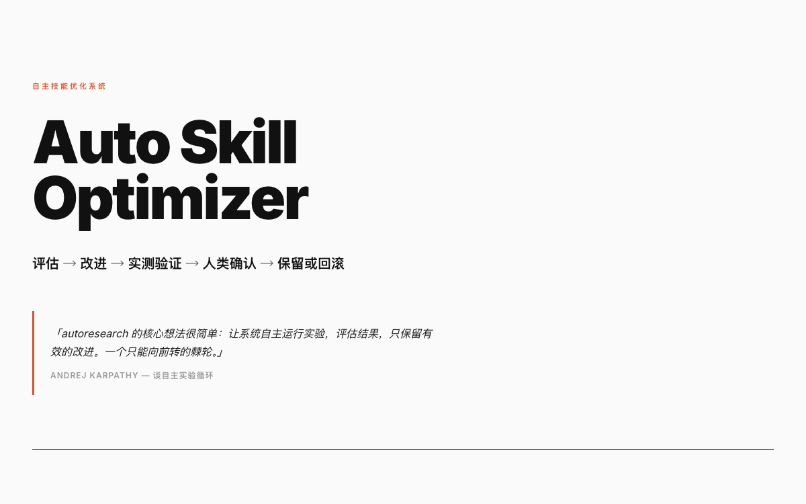
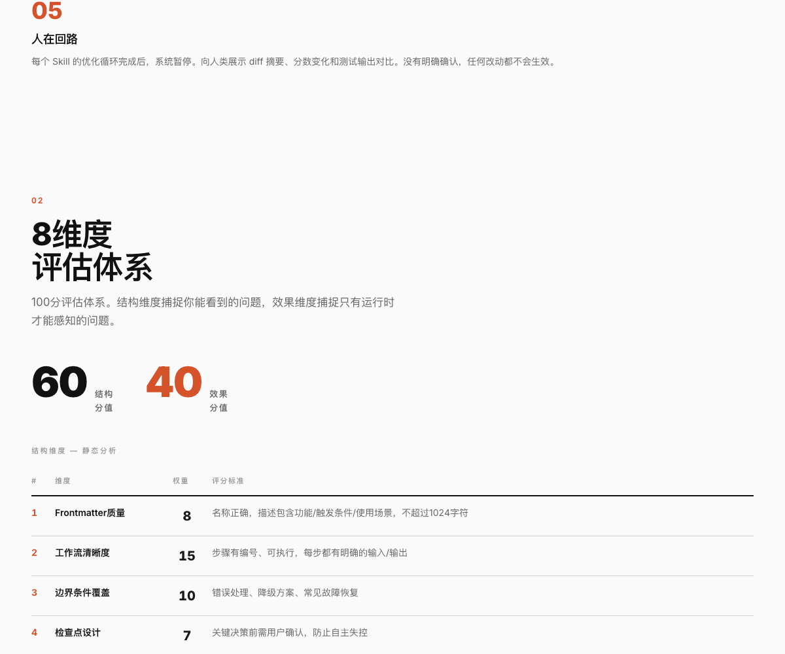
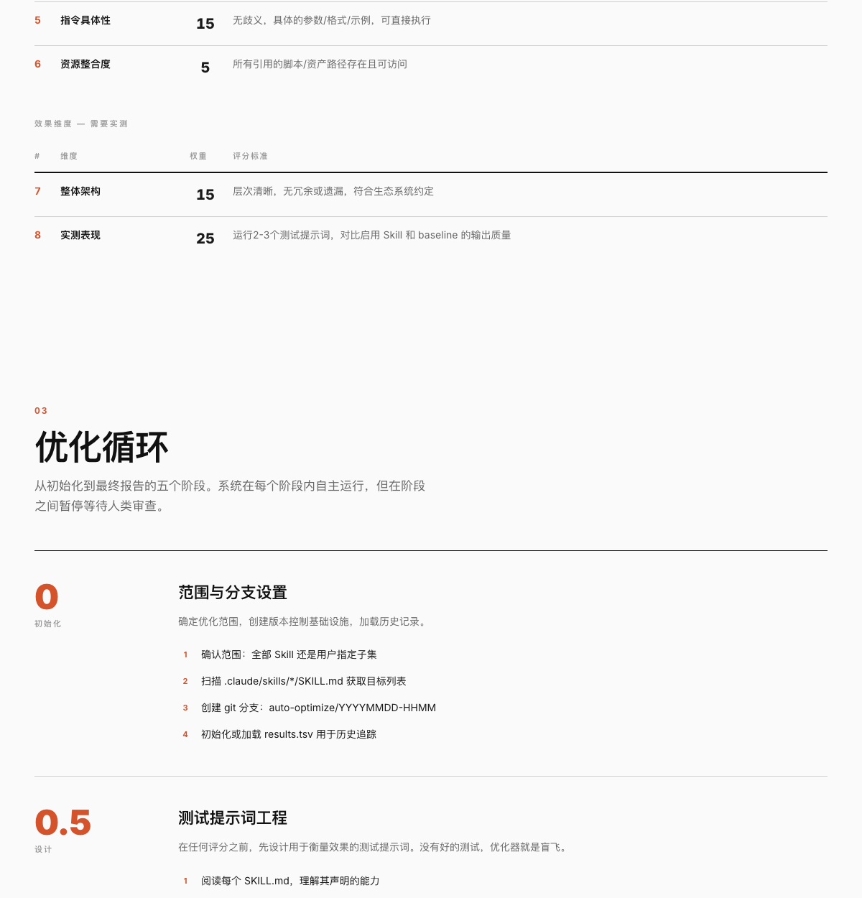
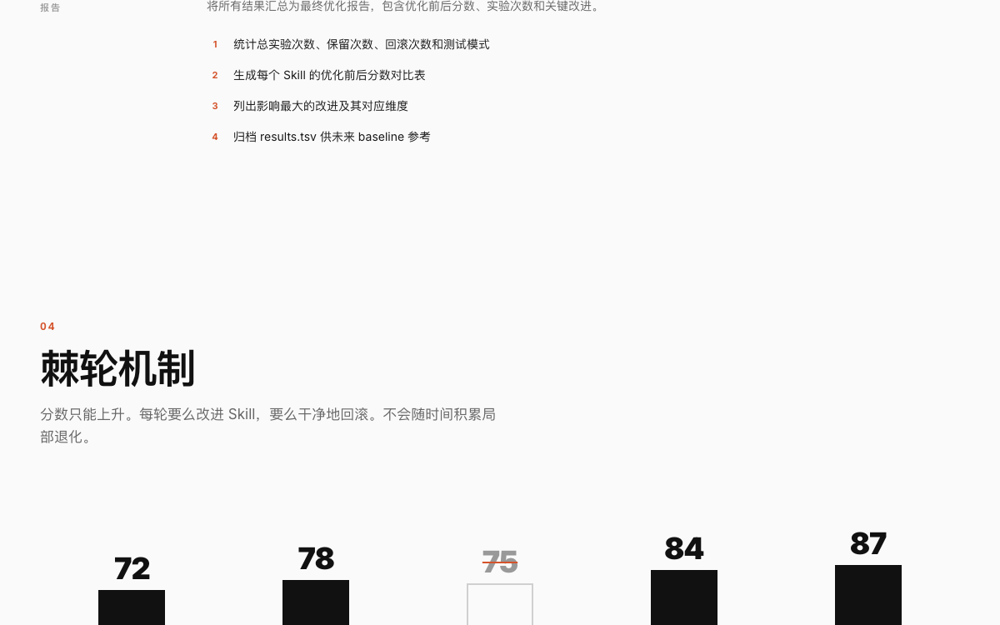
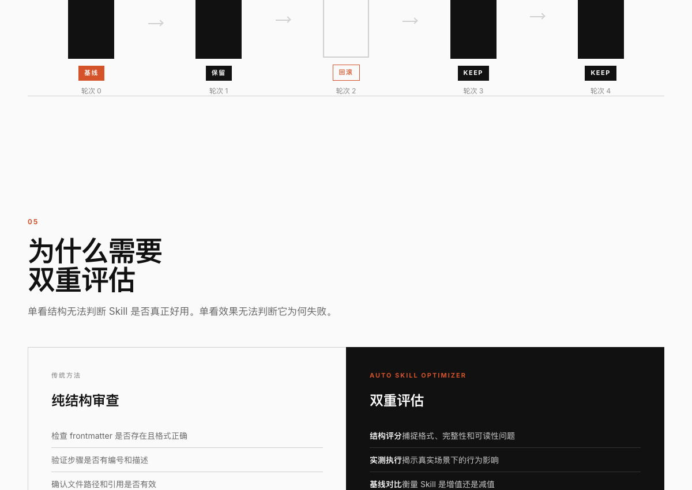

# Auto Skill Optimizer

**像训练模型一样优化你的 Claude Code Skills。**

受 [Andrej Karpathy 的 autoresearch](https://github.com/karpathy/autoresearch) 启发，将自主实验循环从模型训练搬到 Skill 优化领域。核心理念相同：评估、改进、实测验证、保留或回滚。一个只能向前转的棘轮。



> 「autoresearch 的核心想法很简单：让系统自主运行实验，评估结果，只保留有效的改进。一个只能向前转的棘轮。」
> — Andrej Karpathy

---

## 为什么做这个

Claude Code 的 Skill 生态在快速扩张。当你有 10 个 Skills 时可以手动维护；当你有 60+ 个 Skills 时，你需要一个系统。

传统的 Skill 审查是**纯结构性的**：检查格式对不对、步骤有没有编号、路径能不能访问。但一个格式完美的 Skill，跑出来的效果可能很差。

Auto Skill Optimizer 做的事情不一样：它同时评估**结构质量**和**实际效果**，然后只保留真正有改进的修改。

---

## 从 autoresearch 到 Skill Optimizer

这个项目直接受 Karpathy autoresearch 启发。autoresearch 的做法是：写一个 `program.md` 定义目标和约束，让 agent 自主生成和测试代码变更，只保留可测量的改进。

我们把同样的思路搬到了 Skill 优化：

| autoresearch | Auto Skill Optimizer | 为什么这样映射 |
|:---|:---|:---|
| `program.md` | 本 SKILL.md | 定义评估标准和约束规则 |
| `train.py` | 每个待优化的 SKILL.md | 被优化的资产，每次实验只改它 |
| `val_bpb` | 8 维加权总分（满分100） | 可量化的优化目标 |
| `git ratchet` | keep / revert 机制 | 只保留有改进的 commit |
| `test set` | test-prompts.json | 验证改进是否真的有效 |
| 全自主运行 | **人在回路** | Skill 的好坏比 loss 更微妙，需要人的判断 |

关键区别：autoresearch 是全自主的（loss 数值可以自动比较），Skill 优化增加了**人在回路**（每个 Skill 优化完后暂停，展示 diff 和分数变化，等人确认再继续）。因为 Skill 的「好坏」不像 loss 那样可以纯数值判断。

---

## 五条核心原则

| # | 原则 | 说明 |
|:---|:---|:---|
| 01 | **单一可编辑资产** | 每次只改一个 SKILL.md，变量可控，改进可归因 |
| 02 | **双重评估** | 结构评分（静态分析）+ 效果验证（跑测试看输出） |
| 03 | **棘轮机制** | 只保留改进，自动回滚退步，分数只升不降 |
| 04 | **独立评分** | 评分用子 agent，避免「自己改自己评」的偏差 |
| 05 | **人在回路** | 每个 Skill 优化完后暂停，用户确认再继续下一个 |

---

## 8 维度评估体系

总分 100。结构维度靠静态分析（60分），效果维度必须实测（40分）。



### 结构维度（60分）

| # | 维度 | 权重 | 评分标准 |
|:---|:---|:---:|:---|
| 1 | Frontmatter 质量 | 8 | name 规范、description 含触发词、长度合规 |
| 2 | 工作流清晰度 | 15 | 步骤明确可执行，每步有明确输入/输出 |
| 3 | 边界条件覆盖 | 10 | 异常处理、fallback 路径、错误恢复 |
| 4 | 检查点设计 | 7 | 关键决策前有用户确认 |
| 5 | 指令具体性 | 15 | 有具体参数/格式/示例，可直接执行 |
| 6 | 资源整合度 | 5 | references/scripts/assets 路径可达 |

### 效果维度（40分）

| # | 维度 | 权重 | 评分标准 |
|:---|:---|:---:|:---|
| 7 | 整体架构 | 15 | 结构层次清晰，与生态一致 |
| 8 | **实测表现** | **25** | 跑 2-3 个测试 prompt，对比带 Skill vs 不带 Skill 的输出质量 |

> 实测表现权重最高（25分）。Skill 写得再漂亮，跑出来效果不好就是零。

---

## 优化循环

五个阶段，从初始化到汇总报告。系统在每个阶段内自主运行，但在阶段之间暂停等待人类确认。



```
Phase 0    初始化        确定范围，创建 git 分支，加载历史记录
Phase 0.5  测试设计      为每个 Skill 设计 2-3 个测试 prompt
Phase 1    基线评估      8 维度打分，建立优化前基准线
Phase 2    优化循环      诊断→改进→重评→keep/revert，最多 3 轮
Phase 3    汇总报告      Before/After 分数表 + 关键改进摘要
```

**Phase 2 的核心逻辑**：

1. 找出得分最低的维度
2. 针对该维度生成 1 个具体改进方案
3. 编辑 SKILL.md，git commit
4. 子 agent 独立重新评分
5. 新分 > 旧分 → 保留；否则 → git revert
6. 每个 Skill 完成后暂停，展示 diff + 分数变化，等用户确认

---

## 棘轮机制

分数只能上升。每一轮要么改进 Skill，要么干净地回滚。不会随时间积累局部退化。



```
72 (基线) → 78 (保留) → 75 (回滚!) → 84 (保留) → 87 (保留)
```

轮次 2 的 75 分低于当前最优的 78 分，被自动回滚。有效基线始终锁定在 78，后续改进从 78 继续。

---

## 为什么需要双重评估



**纯结构审查**只能告诉你 Skill 写得规不规范。**双重评估**还能告诉你它跑得好不好用。

| 纯结构审查 | Auto Skill Optimizer |
|:---|:---|
| 检查 frontmatter 格式 | 结构评分 + 实测验证同时进行 |
| 验证步骤编号和描述 | 跑真实 prompt 对比输出质量 |
| 确认文件路径有效 | 子 agent 独立评分，避免偏差 |
| 无法判断实际输出质量 | 每轮只改一个维度，精确归因 |
| 无法检测过度约束 | 分数不涨就回滚 |

---

## 快速开始

### 安装

将 `SKILL.md` 放入你的 Claude Code Skills 目录：

```bash
cp SKILL.md ~/.claude/skills/huashu-auto-skill-optimizer/SKILL.md
```

### 使用

```
# 评估所有 Skills 的质量（只评估不改）
> 评估所有 skills

# 优化指定 Skill
> 优化 huashu-slides 这个 skill

# 全量优化（推荐首次使用）
> 优化所有 skills

# 查看历史
> 看看 skill 优化历史
```

### 输出示例

```
┌──────────────────────────┬────────┬────────┬────────┐
│ Skill                    │ Before │ After  │ Δ      │
├──────────────────────────┼────────┼────────┼────────┤
│ huashu-proofreading      │ 78     │ 87     │ +9     │
│ huashu-slides            │ 72     │ 83     │ +11    │
│ huashu-publish           │ 81     │ 88     │ +7     │
├──────────────────────────┼────────┼────────┼────────┤
│ 平均                     │ 77     │ 86     │ +9     │
└──────────────────────────┴────────┴────────┴────────┘
```

---

## 设计灵感

这个项目的设计直接受 **Andrej Karpathy 的 [autoresearch](https://github.com/karpathy/autoresearch)** 启发。

autoresearch 证明了一个优雅的想法：你可以把「写论文」这件事变成一个自主实验循环。定义目标（`program.md`），让 agent 不断生成和测试变更（`train.py`），用可量化的指标（`val_bpb`）决定保留还是回滚。这个棘轮机制保证了质量只升不降。

Auto Skill Optimizer 把同样的思路搬到了 Claude Code Skill 优化。区别在于：

1. **评估更复杂**：Skill 的好坏不像 loss 那样一个数值就能说清楚，需要 8 个维度的加权评分
2. **需要实测**：结构评分只是一半，另一半必须跑真实 prompt 看效果
3. **人在回路**：Skill 的「好」是主观的，需要人来做最终判断

但核心机制完全相同：**只保留可测量的改进，其余全部回滚。**

---

## 约束规则

1. 不改变 Skill 的核心功能和用途
2. 不引入新依赖
3. 每轮只改一个维度，避免多变更无法归因
4. 优化后 SKILL.md 不超过原始大小的 150%
5. 所有改动在 git 分支上，用 git revert 回滚
6. 效果维度必须用子 agent 评分，不能自己改完自己评

---

## 文件结构

```
auto-skill-optimizer/
├── README.md              # 你正在看的文件
├── SKILL.md               # 核心：评估标准 + 优化流程 + 约束规则
├── showcase.html           # Pentagram 风格的可视化展示页
├── assets/                # README 配图
│   ├── aso-hero.png
│   ├── aso-rubric.png
│   ├── aso-cycle.png
│   ├── aso-ratchet.png
│   ├── aso-comparison.png
│   └── aso-mapping.png
└── examples/              # 优化记录示例（待补充）
```

---

## 致谢

- [Andrej Karpathy](https://github.com/karpathy) 的 [autoresearch](https://github.com/karpathy/autoresearch) 提供了核心设计灵感
- [Claude Code](https://claude.ai/code) 的 Skill 生态提供了优化场景
- [花叔](https://x.com/AlchainHust) 的 60+ Skills 实践提供了真实测试环境

---

**License**: MIT
